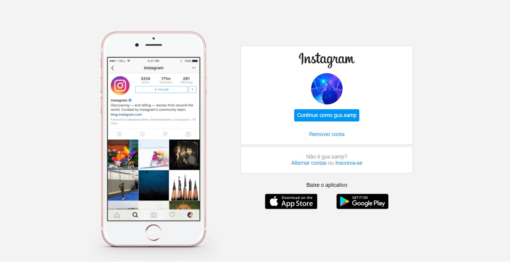

## Primeiro projeto: Recriando a página inicial do Instagram!

### Projeto proposto no Bootcamp HTML Web Developer da Digital Innovation One, onde foi utilizados os conceitos iniciais aprendidos de HTML e CSS utilizando Flexbox.

### Página recriada:

